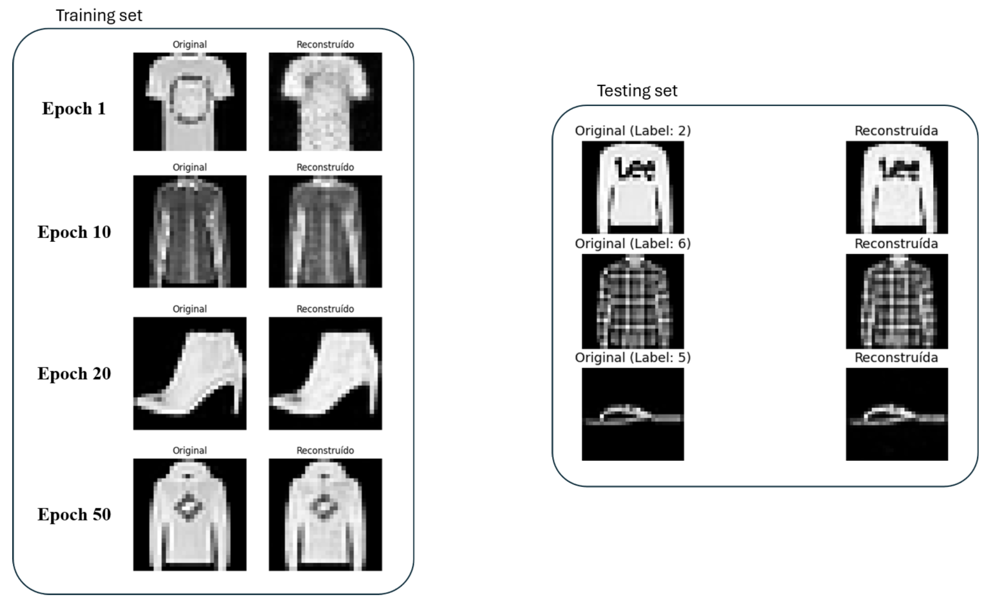
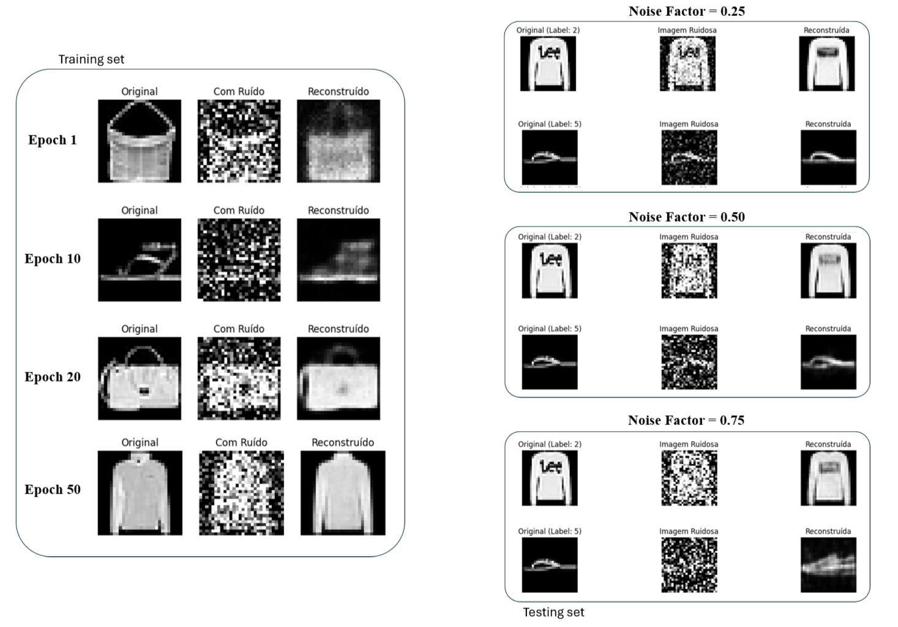
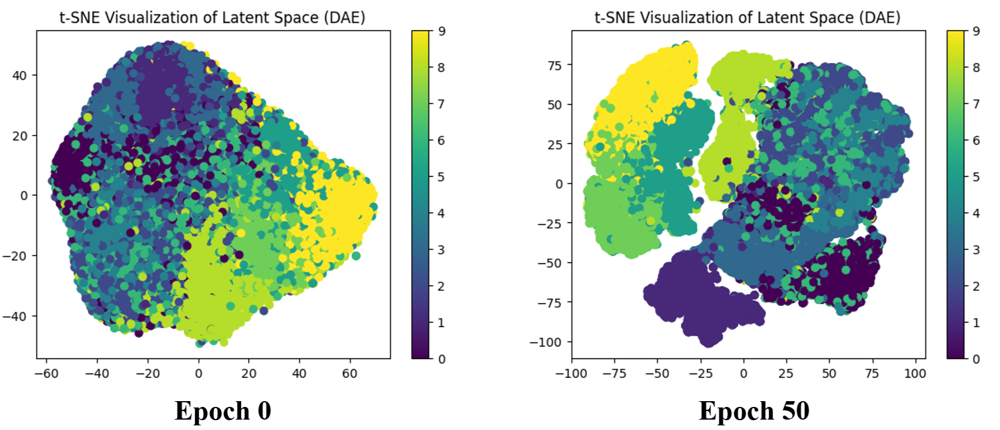
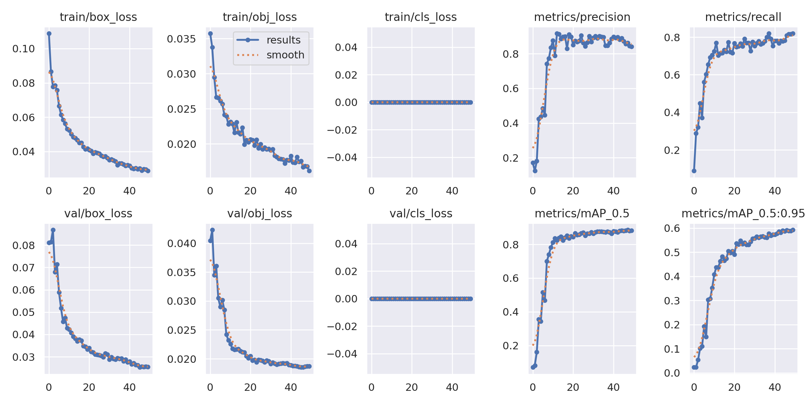

# 🧠 Autoencoders and YOLOv5 Object Detection

> **Autoencoders for Image Reconstruction & YOLOv5 for Object Detection**
> Master's in Electrical and Computer Engineering (MIEEC) — University of Coimbra, 2024/2025

This project explores Generative Models through the implementation of various Autoencoders for image reconstruction and denoising tasks. The second part of the project focuses on Object Detection using YOLOv5 on the KITTI dataset.

---

## 📋 Table of Contents
- [Project Overview](#-project-overview)
- [Part 1: Autoencoders (AE, DAE, VAE)](#-part-1-autoencoders-ae-dae-vae)
- [Part 2: YOLOv5 Object Detection](#-part-2-yolov5-object-detection)
- [Repository Structure](#-repository-structure)
- [Getting Started](#-getting-started)
- [Technical Report](#-technical-report)

---

## 🔍 Project Overview

| Feature | Part 1: Autoencoders | Part 2: YOLOv5 Object Detection |
|---------|----------------------|----------------------------------|
| **Objective** | Analyze Standard, Denoising, and Variational AEs. | Detect cars using YOLOv5 (Transfer Learning vs. Scratch). |
| **Dataset** | FashionMNIST (60k images) | KITTI dataset subset (500 images) |
| **Architectures** | Custom CNN Autoencoders | YOLOv5m (Medium) |
| **Key Metrics** | Reconstruction Loss, F1-Score | mAP@0.5, Precision, Recall |

---

## 🖼️ Part 1: Autoencoders (AE, DAE, VAE)

### Architectures Explored
1. **Standard Autoencoder (AE)**: Baseline autoencoder to compress and reconstruct images.
2. **Denoising Autoencoder (DAE)**: Robust autoencoder trained by corrupting the input with noise (noise factor = 0.5) to prevent identity function learning.
3. **Variational Autoencoder (VAE)**: Learns a probabilistic latent space representation, enabling generative capabilities.

### Results & Visualizations
The models were trained for 50 epochs and evaluated on image reconstruction fidelity and a classification task from the learned latent space.

**Reconstruction with Standard Autoencoder:**
<p align="center">
  
</p>

**Denoising with DAE (Different Noise Levels):**
<p align="center">
  
</p>

**Latent Space Clustering (DAE):**
<p align="center">
  
</p>

---

## 🚗 Part 2: YOLOv5 Object Detection

### Transfer Learning vs. Training from Scratch
We utilized **YOLOv5m** to detect cars in the KITTI dataset. The project compares training the model from scratch versus using pretrained weights (transfer learning) to assess convergence speed and final performance.

### Results
The pretrained model demonstrated rapid convergence and significantly outperformed the model trained from scratch, achieving high mAP values by epoch 10.

**Pretrained YOLOv5m Training Metrics:**
<p align="center">
  
</p>

---

## 📁 Repository Structure

```text
autoencoders-and-yolov5/
│
├── 1_Autoencoders.ipynb                    # Standard Autoencoder implementation
├── 2_Denoising_Autoencoders.ipynb          # Denoising Autoencoder implementation
├── 3_Variational_Autoencoders.ipynb        # Variational Autoencoder implementation
├── 4_YOLOv5_Object_Detection.ipynb         # YOLOv5 training & evaluation
├── report.md                               # Detailed technical report
├── requirements.txt                        # Dependencies
├── YOLO/                                   # YOLOv5 training results & configurations
└── assets/                                 # Images, plots, and diagrams used in the report
```

---

## 🚀 Getting Started

### 1. Clone the repository
```bash
git clone https://github.com/andresilva9/autoencoders-and-yolov5.git
cd autoencoders-and-yolov5
```

### 2. Install dependencies
Ensure you have Python 3.8+ installed, then run:
```bash
pip install -r requirements.txt
```

### 3. Run the Notebooks
Open Jupyter Notebook or JupyterLab to explore the implementations:
```bash
jupyter notebook
```

---

## 📄 Technical Report
For an in-depth analysis of the architectures, loss functions, hyperparameter choices, and comprehensive results, please read the [Full Technical Report](report.md).

---
*Created by André Silva and a fellow student.*
