# Applied Deep Learning
## Practical Assignment 2 - Autoencoders and Object Detection
**Authors:** André Silva - 2019231139 & Fellow Student

## 1. Introduction
This report presents the main methods, results, and analysis for the second practical assignment within the scope of the Applied Deep Learning course. Part I of this assignment focuses on Generative Models, specifically Autoencoders, applied to reconstruction and denoising tasks. The primary goal is to explore the differences between Standard Autoencoders, Denoising Autoencoders, and Variational Autoencoders. Part II involves the implementation and evaluation of YOLO v5 for object detection.

## 2. Part I: Reconstruction and denoising using Autoencoders

### 2.1 FashionMNIST Dataset
In Part I, the dataset utilized is Fashion MNIST, consisting of 60,000 images in the training set and 10,000 images in the test set. Each sample is a grayscale image with dimensions of 28 × 28 pixels (1 × 28 × 28, representing a single color channel) and is associated with a label corresponding to one of 10 classes. The classes include T-shirt, Trouser, Pullover, Dress, Coat, Sandal, Shirt, Sneaker, Bag, and Ankle Boot, labeled numerically from 0 to 9, respectively. The dataset can be accessed through the `torchvision.datasets` module.

### 2.2 Autoencoders
Generative Models are a prominent area of research in Deep Learning, with Autoencoders (AEs) playing a significant role. AEs are auto-associative neural networks designed to compress input data $x$ into a latent representation $z(x)$ and then reconstruct the original input from this compressed form, resulting in $y(z)$. Their architecture consists of an encoder, which maps the input to the latent space, and a decoder, which reconstructs the input from the latent representation. An AE generates as many outputs as there are inputs, with the reconstruction error calculated for each input-output pair. Similar to other convolutional neural networks, it is trained using backpropagation techniques to optimize the network's parameters and minimize the reconstruction error.

  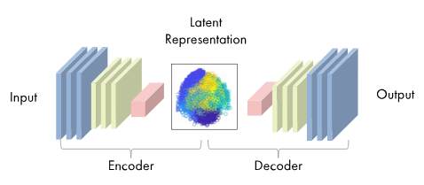
   <em>Architecture of an Autoencoder</em>

The architecture of an autoencoder can consist of fully connected layers with non-linear activation functions, commonly used for data compression, or it can incorporate convolutional layers. A deep convolutional autoencoder (DCAE), which includes both convolutional and deconvolutional layers, is particularly effective for tasks such as image denoising and image compression.

#### Denoising Autoencoders
A Denoising Autoencoder (DAE) is a modification of a standard Autoencoder (AE) designed to prevent the network from learning the identity function. In this context, the identity function refers to a situation where the AE simply maps the input directly to the output without extracting any meaningful features.

The role of the DAE is to address this issue by training on noisy input data, learning to reconstruct the clean original from corrupted versions, improving robustness. This approach prevents the network from memorizing data and promotes more generalizable latent representations. While its architecture is identical to a standard Autoencoder, the key difference lies in training: the DAE receives noisy inputs but calculates the loss by comparing the reconstructed output to the clean original, enabling it to effectively recover true data from distorted inputs.

#### Variational Autoencoders
Autoencoders face limitations like overfitting, loss of variety in outputs, and unstructured latent spaces, leading to poor generalization and unreliable interpolation. To address these limitations, the Variational Autoencoder (VAE) aims to learn not just a direct mapping from $x$ to $z(x)$, but a distribution in the latent space, typically modeled as a Gaussian. Unlike traditional Autoencoders architectures, which encode a discrete and deterministic representation focused on data reconstruction, VAEs encode a continuous and probabilistic latent space, enabling also the generation of new data samples that resemble the original input data.

  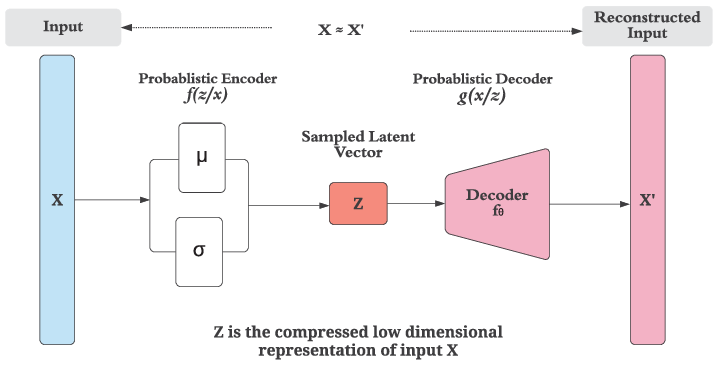
   <em>Schematic of a Variational Autoencoder</em>

The process of sampling from a probabilistic distribution parametrized by the encoder is inherently non-differentiable, creating challenges for models trained via backpropagation. The reparameterization trick resolves this issue by enabling sampling while maintaining differentiability.

### 2.3 Training Setup
For this assignment, all three types of autoencoders — namely AE, DAE, and VAE — were tested. While each model required specific modifications, they all shared the same encoder and decoder architecture, including the same number of convolutional layers and filters. Between the convolutional layers, batch normalization was applied. To reduce the image size, a stride of 2 was used in two of the layers. The activation function selected was Leaky ReLU with a slope of 0.02, and SELU was used for the linear layers. The decoder mirrors the structure of the encoder but outputs through a sigmoid activation function in the final layer.

  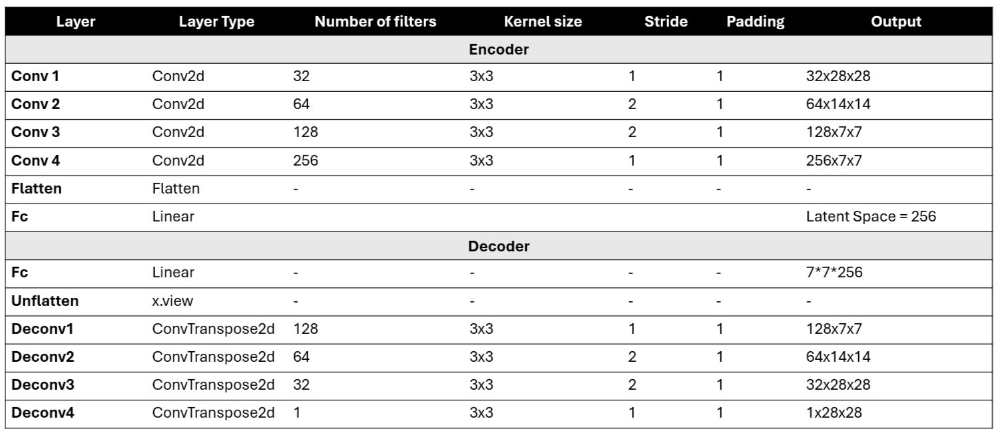
   <em>Encoder and Decoder Architectures Used</em>

The models were trained for 50 epochs using backpropagation with the Adam optimizer, set to a learning rate of 0.0001. The reconstruction loss function employed was the Mean Squared Error (MSE), calculated between the reconstructed images and their corresponding originals. For the Variational Autoencoder, the final loss was computed as the sum of the MSE and the KLD. In the case of the Denoising Autoencoder, the MSE loss was also calculated based on the original and reconstructed images; however, the encoder received a corrupted version of the input images with a noise factor of 0.5.

### 2.4 Results

#### Autoencoders
The learning process of the Autoencoder over 50 epochs showed a clear decrease in losses. The latent space became more compact and separable after training. 

  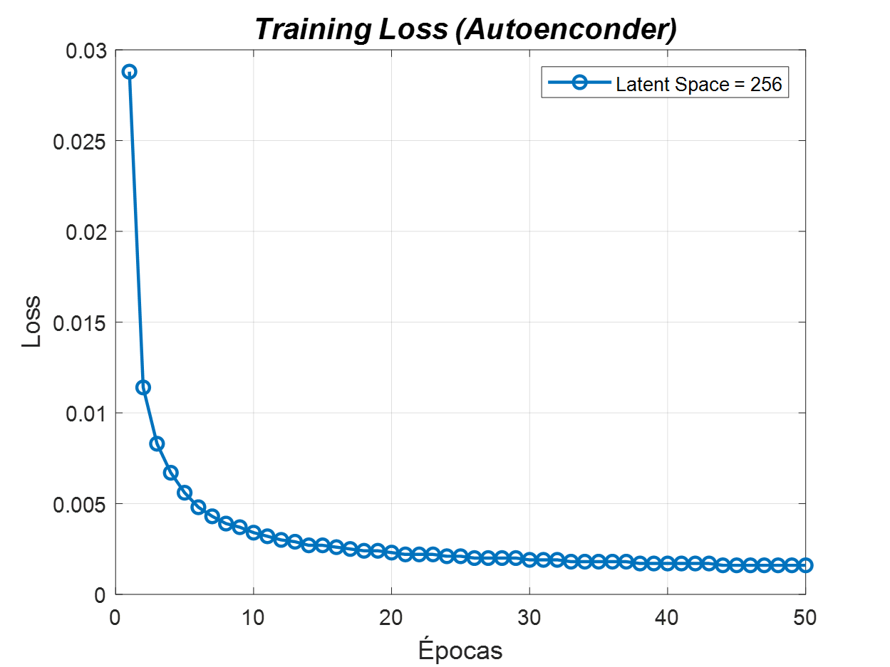
  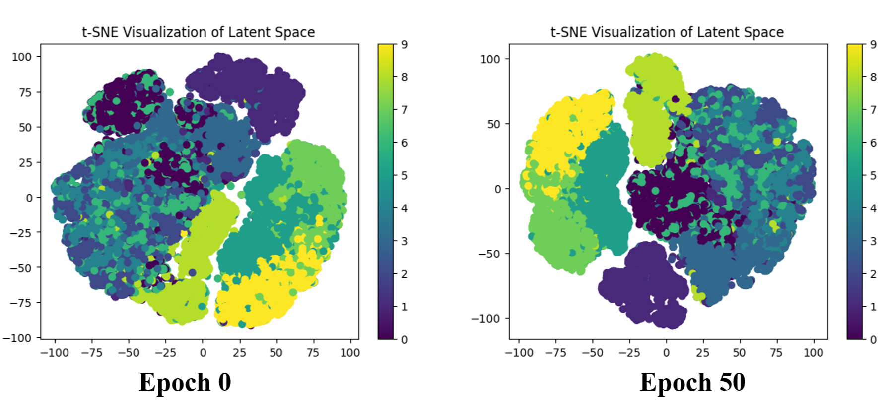
   <em>Training loss curve and latent space before/after training</em>

The model progressively captures varying levels of detail in the images. The reconstructed images demonstrate the model's ability to efficiently recreate images from the test set.

  

In the classification task, the model achieved impressive performance after only 5 epochs of training, with an F1 score of 0.846.

#### Denoising Autoencoders
The model effectively learned and converged during training. The latent space visualizations highlight the progressive organization of the encoded data, with clusters becoming significantly more distinct over 50 epochs.

  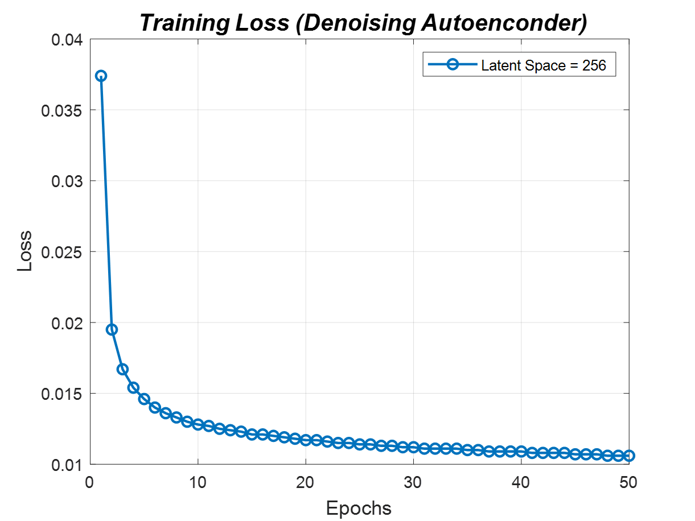
  

At lower noise levels (0.25), the reconstructions are highly accurate, preserving most of the original details. As the noise level increases to 0.75, the quality of the reconstructions declines but still captures the overall structure of the input images.

  

#### Variational Autoencoders
The loss curve shows a steady decrease, indicating effective learning. The t-SNE visualizations reveal the progression of the latent space from an unstructured state at Epoch 0 to more organized clusters by Epoch 50.

  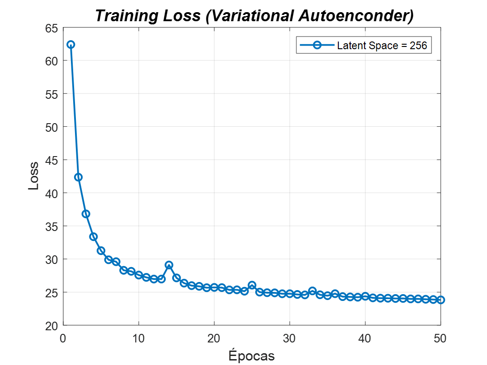
  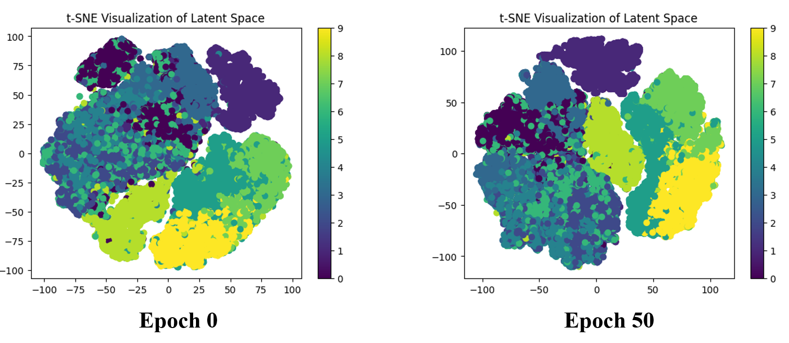

While the model effectively reconstructs the overall structure of the images, finer details are often lost. This behavior is consistent with the probabilistic nature of VAEs.

  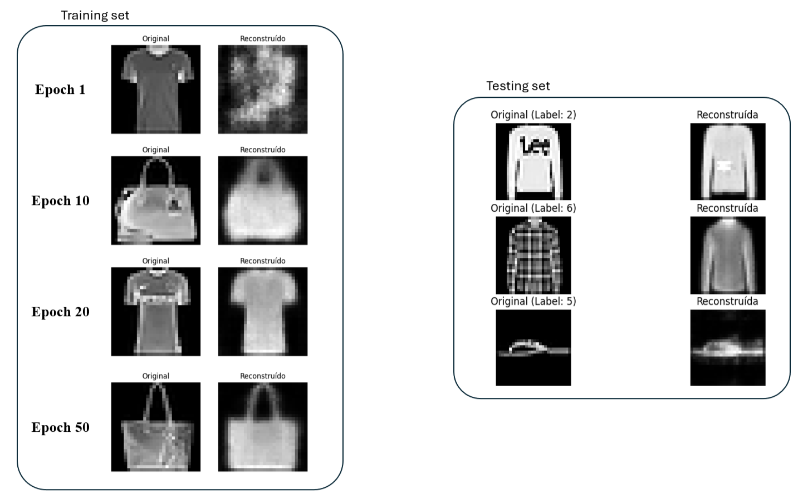

## 3. Part II: Object Detection

### 3.1 KITTI Dataset
For Part II, we utilized a subset of the KITTI dataset consisting of 500 raw RGB images and their corresponding labels for three object classes: Car, Person, and Cyclist. As the assignment specifically required training the YOLOv5 network using only "object class 0 (cars)," all labels corresponding to other object classes were excluded from the dataset.

### 3.2 Network Architecture
We utilize the YOLOv5 object detection model (YOLOv5m variant). YOLOv5 is structured into three main components: Backbone, Neck, and Head/Output.

  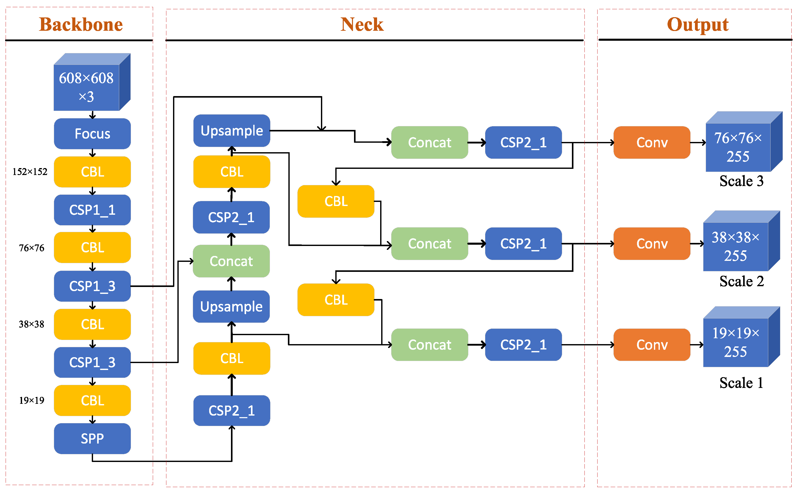

### 3.3 Results

#### YOLOv5m Trained from Scratch
The results indicate a consistent decrease in training and validation losses throughout the epochs, though with considerable noise and variability. The convergence rate is notably slower compared to the pretrained model. Precision and recall metrics stabilize at a later stage.

  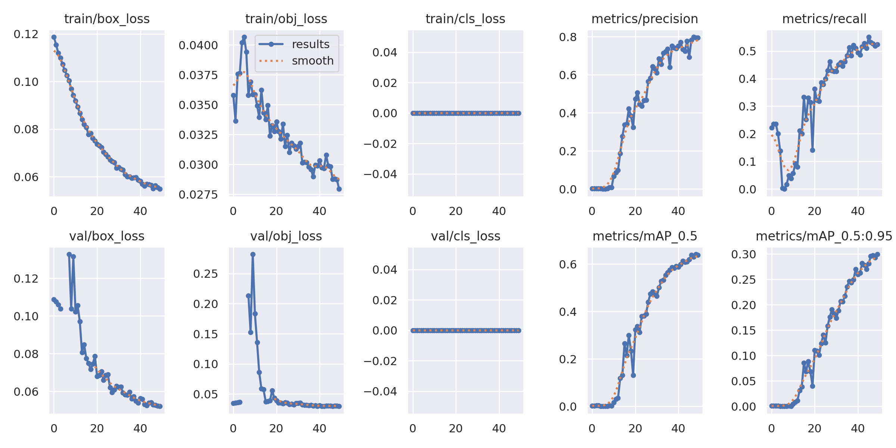

#### YOLOv5m PreTrained (Transfer Learning)
The pretrained model demonstrates rapid convergence in both training and validation losses, stabilizing earlier in the training process. High mAP values are achieved as early as around 10 epochs.

  

### Comparison
A comparison between the two training approaches reveals that the transfer learning model converges faster due to the reuse of pretrained weights, achieves higher mAP scores, and exhibits better generalization earlier in the training.
